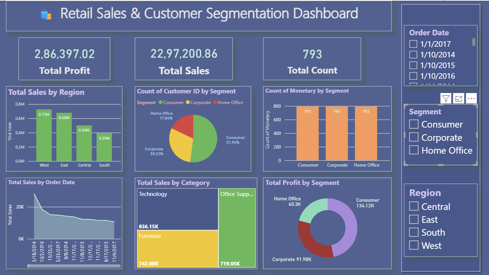

# Retail Sales and Customer Segmentation Dashboard

This project uses Power BI and Python for analyzing retail sales and segmenting customers using the RFM (Recency, Frequency, Monetary) model.

---
## 📌 What is RFM?
- **Recency**: How recently a customer purchased
- **Frequency**: How often they purchase
- **Monetary**: How much they spend
Used to group customers into High-Value, At-Risk, Lost, etc.
---

## 📊 Tools Used
- **Power BI** for data visualization and dashboarding
- **Python (Jupyter Notebook)** for data cleaning and RFM segmentation
- **Pandas, NumPy, Matplotlib** for data processing and analysis
---
## 📁 Files
- `Retail_Sales.pbix`: Power BI dashboard file
- `RFM.ipynb`: Python notebook for RFM analysis
---
## 🚀 Features
- Dynamic dashboards for sales trends, profits, and customer behavior
- RFM-based customer segmentation
- Data cleaning and transformation using Python
---
## 🧠 Insights
- Identify high-value and at-risk customers
- Visualize sales performance by category, region, and time
- Data-driven decision-making for retail strategy
---
## 🔧 Setup
Let’s polish those steps slightly so they’re more professional and clearer to read. Here’s the improved version of steps 2–4 for your `README.md`:

1. Clone the repository:
   ```bash
   git clone https://github.com/DuruHarshitha/retail-sales-and-customer-segmentation-dashboard.git
   ```

2. Open the `RFM.ipynb` notebook in Jupyter and run all cells to perform RFM segmentation and generate the output file (e.g., a cleaned CSV).
3. Load the generated file (from the notebook) into Power BI using **Get Data → CSV**.
4. Open the `Retail_Sales.pbix` file in Power BI Desktop to explore the interactive dashboard.
---
## 📸 Dashboard Preview

<p align="center">
  
</p>

---
## 📄 License
[MIT License](LICENSE)

---
